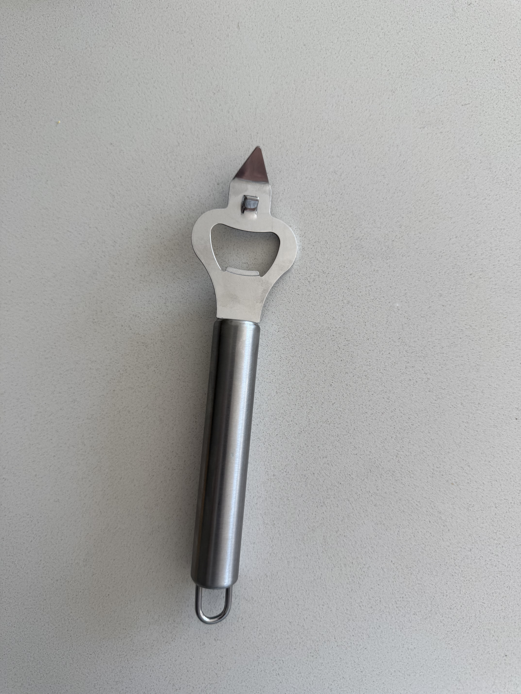
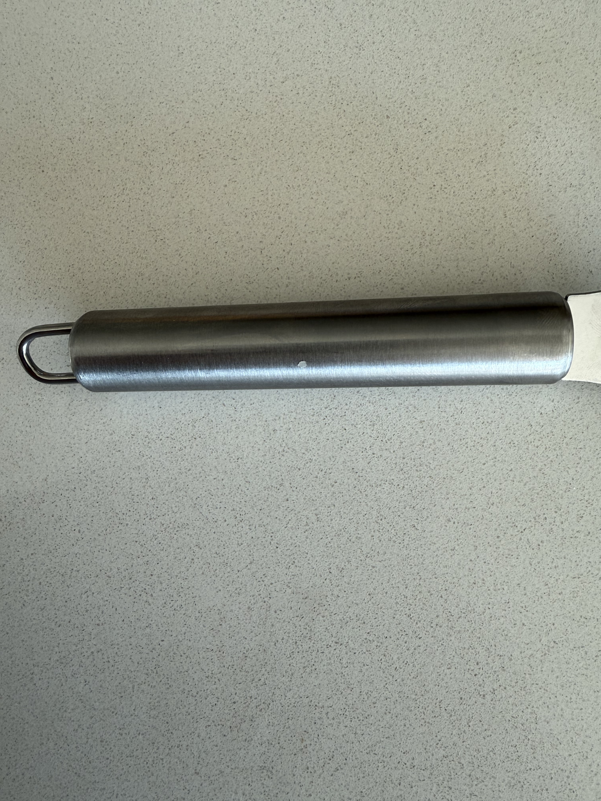
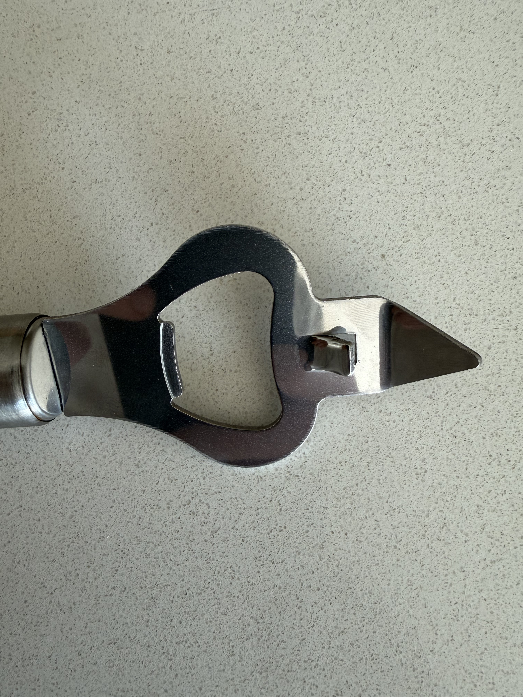

# A1 – [Topic]

## Objective

## Analyze
### Task A: Portfolio Analysis
### Portfolio 1: Thanh Tran Mechanical Engineering Portfolio
Portfolio: [Thanh Tran Mechanical Engineering Portfolio] (https://thanhvtran.com/)

#### Navigability 
I was able to find all of his projects and internships like his Space X internship under 60 seconds. On the top of his homepage there was a projects tab and the Space X internship took one click to give me pictures and description of what he all did at his internship. Thanh also made a timeline which shows all of his projects in chronological order with a button that says read more if you wanted information. The timeline improves navigation by showing when everything happened and how many years he has been doing projects.

#### Reproducibility
His portfolio shows the parts and projects that he made, but it does not provide enough information for me to look at it and create the exact model he created. You can get a good idea of how to create it from the pictures posted, but it is missing dimensions, materials, drawings, and step-by-step manufacturing processes. I would definitely have to contact him to recreate his projects.

#### Evidence Of Reasoning
He mostly just provides the information of what he did other than why he did it. He would briefly explain reasoning behind some decisions like lower cost or lower welding takt time for his Space X internship. More explanation of why certain materials, designs, or manufacturing procedures were selected would make the decision making clearer to follow.

#### Professional Tone 
The portfolio has a professional tone because it s organized and focuses on his engineering experiences. All of his projects include pictures along with descriptions that explain what he accomplished using engineering vocabulary. The portfolio also includes his resume, internships, and engineering projects all in individual sections. This allows an employer to easily understand his level of experience. The design is consistent throughout the website and does not distract from his engineering work.

### Portfolio 2: Nathan Hoong Engineering Portfolio
Portfolio: [Nathan Hoong Engineering Portfolio] (https://nhoong.github.io/)

#### Navigability 
The portfolio is very easy to navigate because the projects are displayed directly on the first page. I was able to find his senior Capstone Project under 60 seconds. The project includes pictures that shows what he worked on, how he made it, and also provided another link to a full report which has all the information you need. This made it easy to locate the project first and find additional information if needed.

#### Reproducibility
This portfolio provides much more information for being able to reproduce the products. For example his senior Capstone Project includes dimensions. detailed drawings, pictures from all angles, and even a full report that umps into the whole process even including failures that lead to solutions. This would allow someone to easily reproduce his product without having to contact him a lot. Not all of the projects have that full report but they do all have drawings with dimensions.

#### Evidence Of Reasoning
The portfolio provides evidence of reasoning, but the amount varies between projects. In the full report for the Capstone Project, he explains why certain decisions were made instead of just showing the final design. However, some of the other projects provide less explanation of reasoning and just photos on the final design and drawings to assemble it. Including the same level of reasoning from the capstone report in the other projects would make his decision making easier to follow.

#### Professional Tone 
The portfolio has a professional tone because the projects are organized and presented with engineering related information, pictures, drawings, and even reports. All of his descriptions focuses on the work he completed and avoids casual vocabulary. The resume, work experience, and detailed project information also makes the portfolio appropriate to be seen by a potential employer.

### Task B: Product Analysis
#### Product: Handheld Bottle Opener 

##### Primary Function
The primary function of the bottle opener is to use leverage to remove a bottle cap. The user applies force to the handle, which creates a moment about the contact point on the bottle cap. The hooked end applies an upward force underneath the edge of the cap, allowing the cap to be removed with a weaker force from the user.

##### Governing Model
The governing model for the bottle is the moment equation M=Fd. Where M is the moment about the contact point, F is the force applied by the user's hand, and d is the perpendicular distance from the contact point to the line of action of the applied force. The longer handle increases this distance, which allows the user to create a larger moment with the same amount of force. This moment rotates the opener about it's contact point and lifts the bottle cap right off. One assumption is that the bottle opener acts as a rigid body ad will not signifigantly bend or deform while the force is being applied.

##### Component Analysis

###### Complete Bottle Opener

The Bottle opener consist of a long cylinder handle conected to a flat metal opening head. The long handle increases the perpendicular distance from the user's applied force to the contact point, increasing the moment produced.

###### Handle

The handle is long and cylindrical, which allows the user to comfortably grip the bottle opener and aplly force farther away from the contact point. The longer distance increases the moment produced because M=Fd. This allows the bottle cap to be easily removed with less force required from the user. The rounded surface also provides a smooth surface for the hand to apply force.

###### Opener Head

The opener head has an opening with a hooked edge that fits perfectly underneath the edge of the bottle cap. The opposite side of the opening contacts the top ofthe cap and acts as the pivot point. When the user's force is applied to the handle, the head roatates about the contact point and the hooked edge apllies an upward force providing leverage to the cap. The shaope of the opening head allows it to securely contact the cap while the moment from the handle gives enough force to lift it off.

##### Patent Research
Patent Number: US2018083A
Inventor: James Andrew Murdock

###### Alternative Solutions
Two alternative devices that perform the same primary function are a bartender speed opener and a wall mounted bottle opener.
A bartender speed opener , also known as a bar blade, uses a long flat handle with an opening at the end that will catch underneath the bottle cap. The long handle provides levarage and allows the cap to be removed swiftly. A wall mounted bottle opener is fixed to a wall and also uses leverage to remove the cap. Since the opener is fixed in place and does not allow for a moment to be created from the handle, the user moves the bottle instead.

###### Design Decision
One design decision that the engineer made was making the upper contact section longer than the lower hooked section. I believe this was done so the upper section could rest securely on top of the bottle cap to create a stable pivot point, while the shorter lower section could fit nicely underneath the edge of the cap. When the handle is lifted, the opener rotates about the upper contact point and the lower section pulls upward on the cap. 

## Decide

### Homepage Identity
My homepage will clearly show that this is my mechanical engineering portfolio and will provide access to my engineering projects and assignments. I want the projects to be the main focus of the homepage so that an employer or engineer can easily see the work I have completed and navigate to more detailed information. The homepage will focus on what the portfolio contains, while the About me section will provide information about me personally.

### One intentional Customization
I added a personal logo to the portfolio to give the website a recognizable idientity and make it feel more like my own engineering portfolio. The original template did not include anything that visually identified the the portfolio as mine. The logo will provide a consistent visual identifier that can be used throughout the website and will help distiguish my portfolio from the template given to me.

### Documentation Standard

## Communicate

