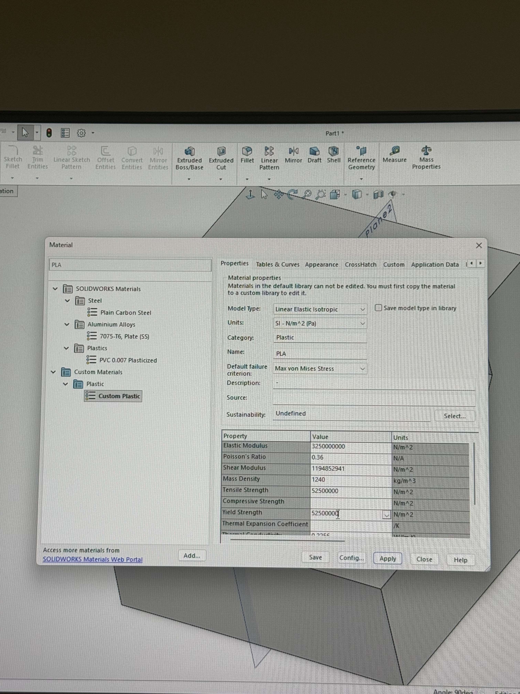
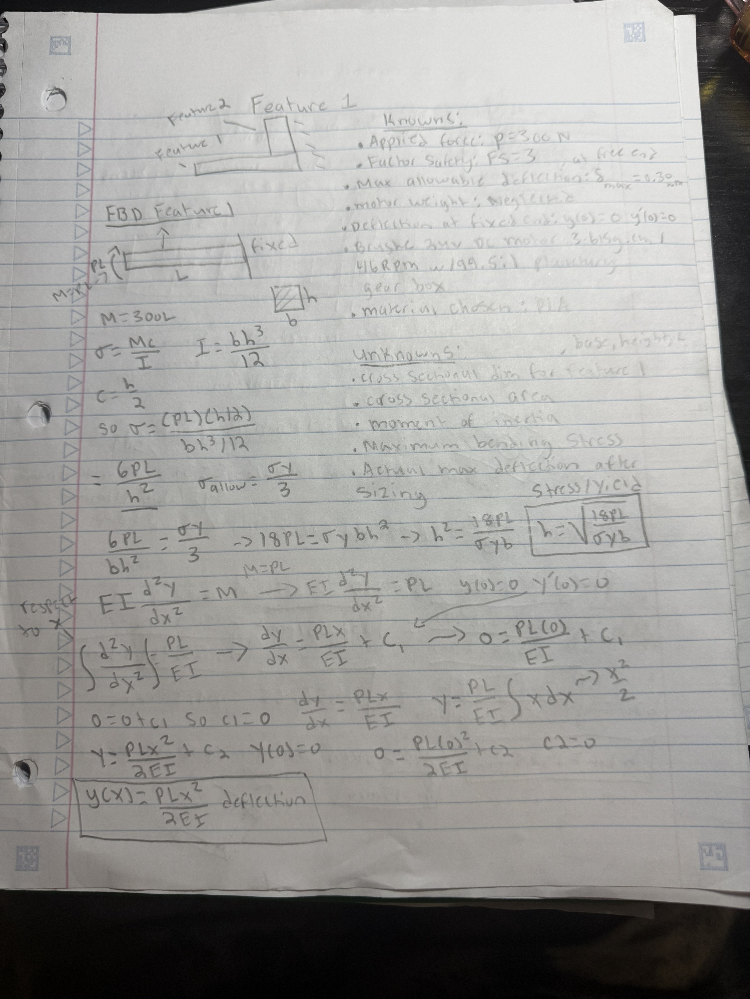
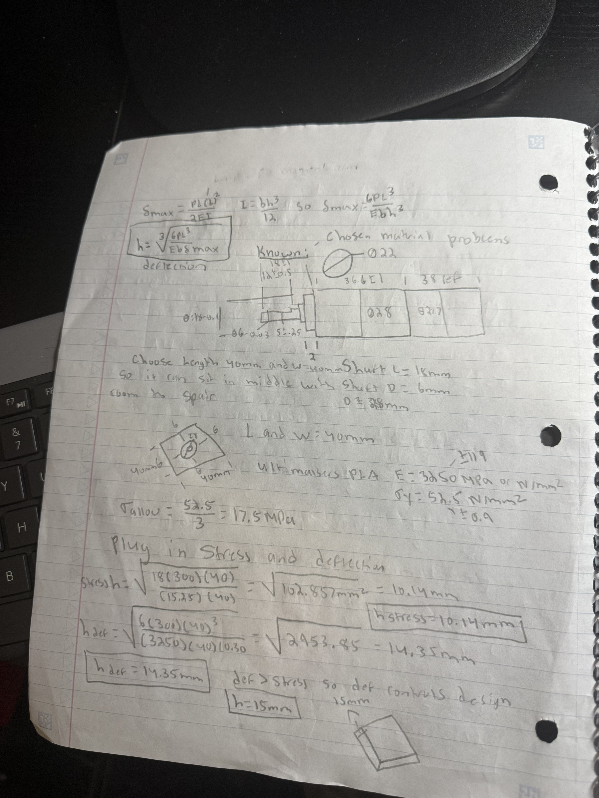
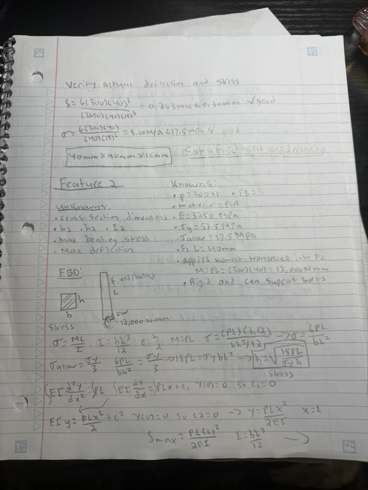
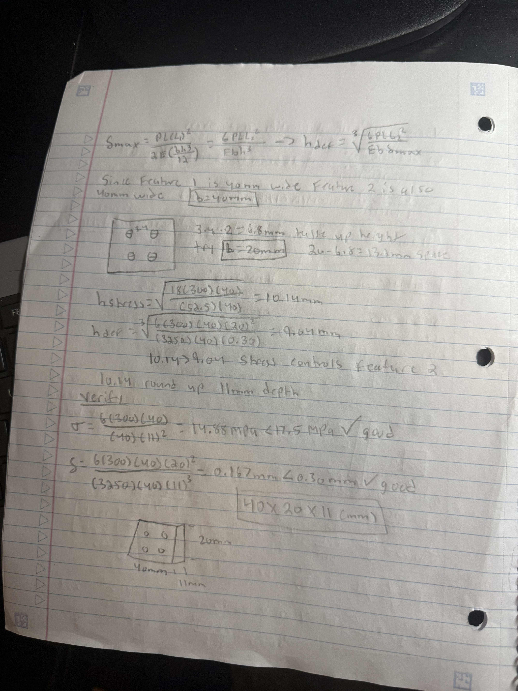
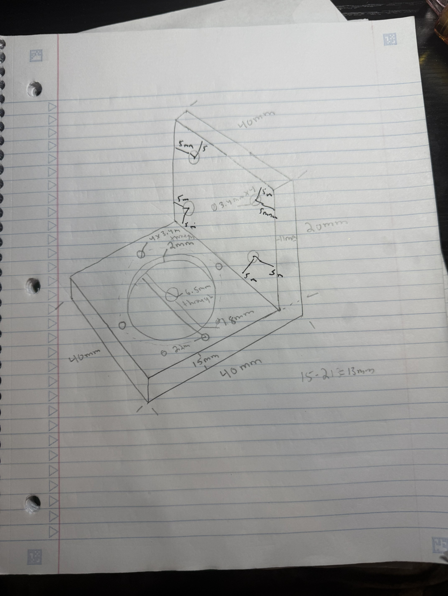
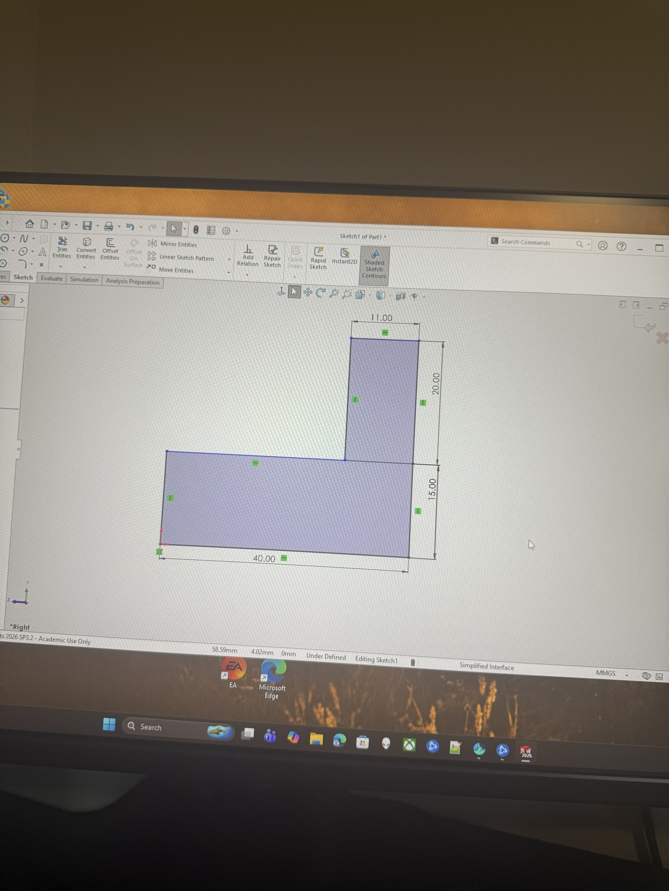
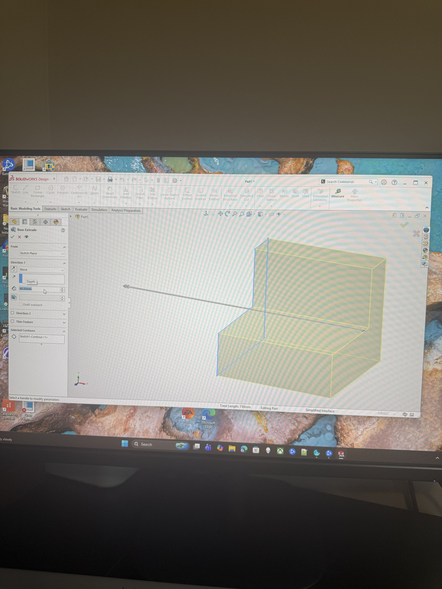
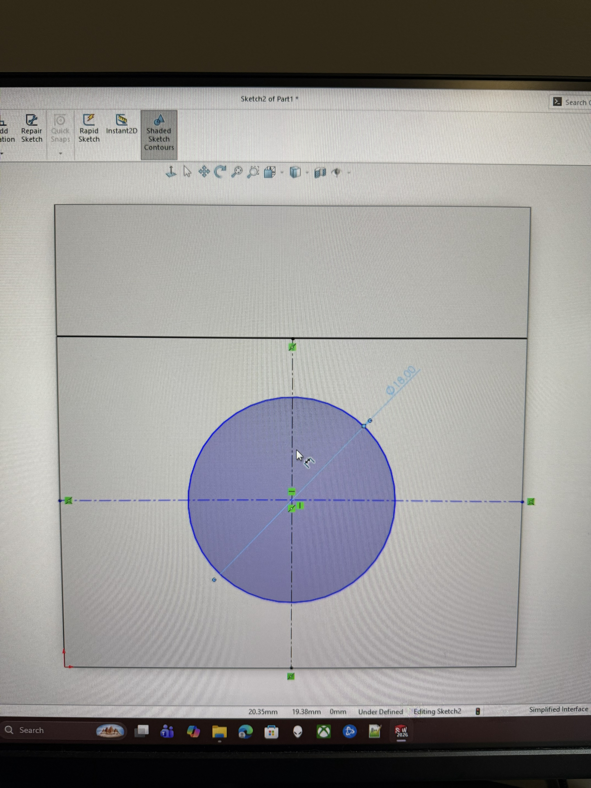
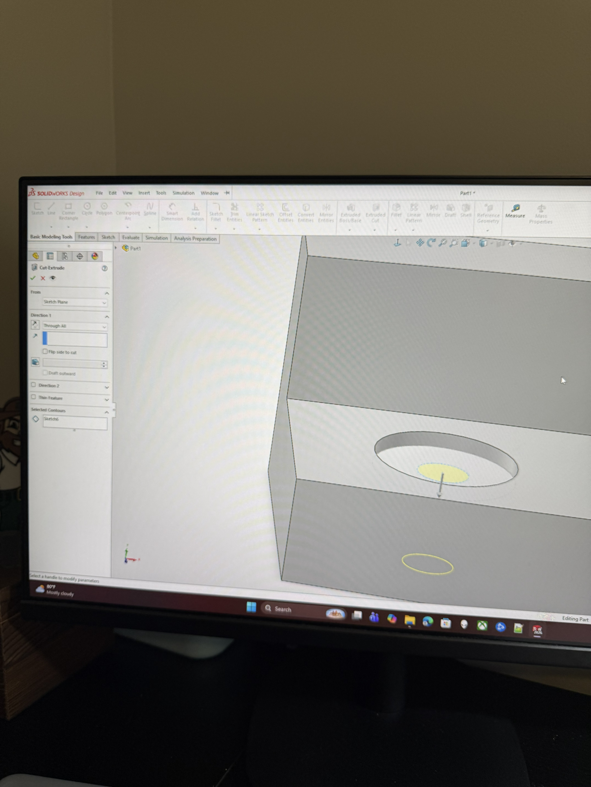

# A4 – [Motor Mount]

## Objective
The objective of this assignment was to design a motor mount that attaches a 24 V DC gear motor to a rigid wall while safely supporting a 300 N load. The mount was designed using beam bending stress and deflection equations with a factor of safety of 3 and a maximum allowable deflection of 0.30 mm. After determining the required dimensions, I created the final design in SolidWorks using PLA, clearance holes, parametric modeling techniques, and gussets to increase stiffness and reduce deflections.

## Analyze
### Material Selection
I selected PLA as the material for the motor mount. PLA was used througoput the hand calculations with a modulus of elasticity of 3250 MPa and a yield strength of 52.5 MPa. With the required safety factor of 3 , the allowable stress was 17.5 MPa. These properties were then used in the stress and deflection calculations to determine the required dimensions for both features.

### Feature 1- Motor Attachment
#### Knowns, unknowns, and FBD
For Feature 1, I modeled the motor attachment as a cantilever beam subjected to a 300 N load. I first identified the known and unknown values and created a free body diagram to represent the loading and boundary conditions. The unkmown cross sectional dimension was then determined using both the stress and deflection requirements.

#### Stress and Deflection Analysis
I analyzed Feature 1 for both bending stress and deflection. I first solved the equations symbolically and then substituted the known values to determine the minimum required cross sectional geometry, both requirements were checked, and the larger required dimension was used so the feature would satisfy both the allowable stress and the 0.30 mm maximum deflection

### Feature 2- Wall Attachment 
#### Knowns, unknowns, and FBD
For Feature 2, I analyzed the portion of the motor mount that attaches to rigid Wall A. I identified the known and unknown values and created a free body diagram showing how the 300 N load is transferred through the mount to the wall. I then used this loading condition to determine the required dimensions of Feature 2.

#### Stress and Deflection Analysis
I analyzed Feature 2 using the beam bending stress and deflection equations. I first solved the equations symbolically and then plugged in the known values and PLA material properties. I compared the dimensions required by the stress and deflection limits and used the larger value so Feature 2 would satisfy both the factor of safety requirement and the 0.30 mm maximum deflection.

## Decide
### Final Motor Mount Design
After completing the stress and deflection analyses for both features, I selected dimensions that met or exceeded the minimum calculated requirements. I then combined Features 1 and 2 into an L-shaped motor mount and created an isometric sketch showing the final dimensions, motor opening, and mounting hole locations.

## CAD Model
### Building The Motor Mount
I began the CAD model by sketching the L-shaped side profile using the dimensions determined from my hand calculations. I then extruded the profile to the required 40 mm width, Creating the main body of the motor mount. This established both Feature 1, which supports the motor, and Feature 2. which attaches the mount to the rigid wall.

### Clearance Holes
After creating the main body, I added the required openings and clearance holes for the bracket to the wall. For the motor attachment, I created the 18 mm diameter recess, 6.5 mm center opening, and four 3.4 mm bolt clearance holes positioned symmetrically around the motor center. I also added four 3.4 mm clearance holes to Feature 2 so the motor mount could be bolted to the rigid wall.

![Lil Circle](
### Deflection Reduction- Gussets
To further reduce deflection in the motor mount, I added triangular gussets at both sides of the 90 degree connection between Features 1 and 2. Each gusset was designed with a 10 mm x 10 mm triangular profile with a 3 mm thickness. The gussets increase the stiffness of the connection and provides additional support between the two features, helping reduce bending and deflection under the applied load. I created one gusset and then mirrored it to the opposite side to maintain symmetric design.
### Parmetric Modeling
I used parametric modeling techniques throughpout the SolidWorks design by creating dimension driven sketches and fully defining the geometry with dimensions and geometric relations. I also created global variables for key design dimensions, including the 40 mm mount width, 15 mm feature thickness, 10 mm gusset size, and 3.4 mm bolt clearances. I linked these parameters to the corresponding dimensions so that important features of the design could be updated more efficiently if the design requirements changed.
### Final CAD Model
After completing the design, I perfromed a final review of the CAD model and noticed that some sketches were still underdefined. I went back and added the necessary dimensions and geometric relations until the sketches were fully defined. This helped ensure that the geometry and hole locations remained constrained to the intended dimensions. The final CAD model included both mounting features, the required clearance holes, The PLA material, parametric design features, and the added gussets.

## Communicate
### Lessons Learned
This assignment helped me better understand how hand calculations can be used to determine dimensions before creating the CAD model. I also learned the importance of fully defining sketches in SolidWorks. Some of my sketches were initially underdefined, and going back to add the proper geometric relations showed me how fully defined sketches make a model more stable and prevent geometry from moving or changing unexpectedly. I also gained more experience using parametric modeling and learned how global variables can make important design dimensions easier to modify. Finally, adding the gussets helped me understand how changes to geometry can increase stiffness and reduce deflection without completely redesigning the mount.
### Time Spent
This assignment took me about 8 hours in total and this time I already had SolidWorks downlaoded which made me very happy.

## Appendix
### Motor Mount Research
- [Gusseted NEMA 17 Motor Mount](https://openelab.io/products/nema17-42mm-stepper-motor-l)
- [Adafruit DC Motor L-Bracket](https://www.adafruit.com/product/3768)
- [AndyMark Motor Mount Bracket](https://andymark.com/products/bearing-and-motor-mount-bracket)
### SolidWorks Part File
[Motor Mount Part](./Motor%20Mount.SLDPRT)
