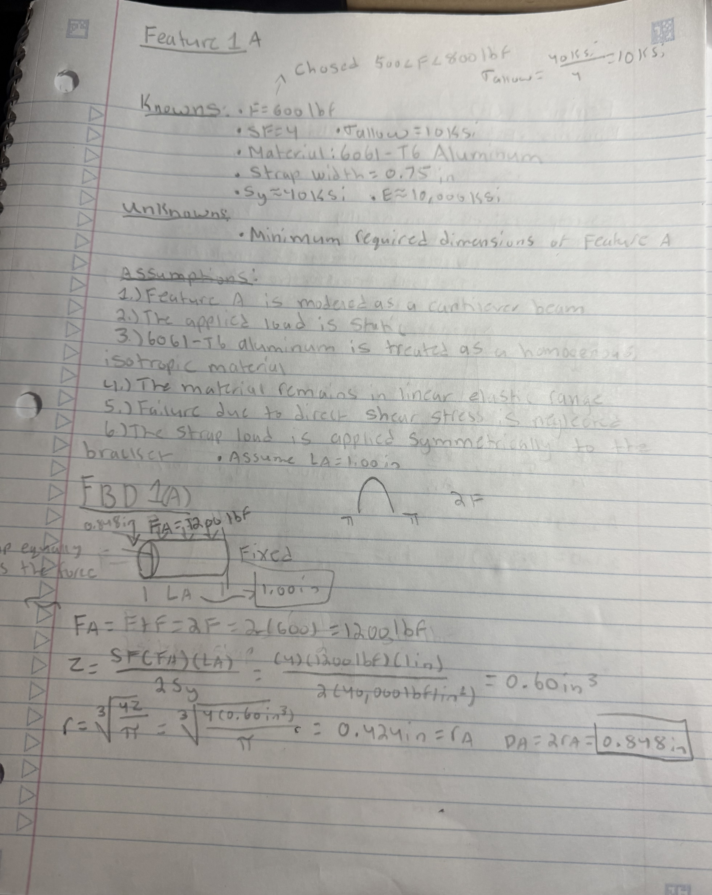
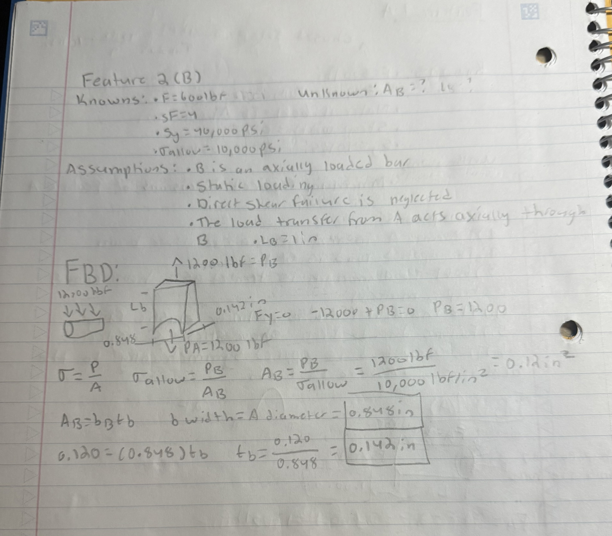

# A5 – [Bracket Design]

## Objective
The objective of this assignment was to design a bracket capable of supporting a symmetric strap load while attaching to a rigid T-beam. The bracket was designed using 6061-T6 aluminum, an applied strap force of 600 lbf, and a factor of safety of 4. Each feature of the bracket was analyzed separately for both stress and stiffness, with a maximum allowable deflection of 0.005 in, to determine the dimensions required for the final design.

## Analyze

### Design Requirements and Material Selection
I selected an applied strap force of 600 lbf and 6061-T6 aluminum for the bracket. The material properties used throughout the analysis were a yield strength of 40 ksi and a modulus of elasticity of 10,000 ksi. With the required factor of safety of 4, the allowable stress was 10 ksi. The bracket was designed symmetrically, and the strap applies two 600 lbf forces, resulting in a total load of 1200 lbf transferred into Feature A.
### Stress Analysis
#### Feature A
I began the stress analysis with Feature A, which supports the polyester strap. I modeled Feature A as a cantilever beam subjected to a distributed strap load with a total resultant force of 1200 lbf. I assumed a 1.00 in length to provide enough space for the 0.75 in wide strap. Using the bending stress and section modulus equations, I determined the minimum required radius and diameter for Feature A.

#### Feature B
The reaction force from Feature A was transferred into Feature B. I modeled Feature B as an axially loaded bar carrying a 1200 lbf load. I assumed a 1.00 in length for Feature B based on the proposed bracket geometry. Using the allowable normal stress, I determined the minimum required cross-sectional area and then selected the width and thickness based on the dimensions established by Feature A.

#### Feature C
Feature C was modeled as a simply supported beam with a concentrated 1200 lbf load at the center. Due to symmetry, each support reaction was 600 lbf. I assumed a 2.00 in span for Feature C and selected a 4.00 in bracket depth based on the proposed geometry. I then used the maximum bending moment and section modulus to determine the minimum required thickness of Feature C.

#### Feature D
Feature D carries one of the 600 lbf reactions transferred from Feature C. I modeled Feature D as an axially loaded section and used the allowable normal stress to determine its minimum required cross-sectional area. The height of Feature D was based on the rigid T-beam interface dimension \(c=1.499\) in, while the bracket maintained the selected 4.00 in depth.
![
#### Feature E
Feature E transfers the load from Feature D into the rigid T-beam and was modeled as an axially loaded section carrying 600 lbf. I used the rigid T-beam dimension \(b=0.9992\) in as the width of Feature E and maintained the selected 4.00 in bracket depth. Using the allowable normal stress, I determined the minimum required cross-sectional area and thickness for Feature E.
### Stiffness Analysis
#### Feature A
I then analyzed Feature A for stiffness using the maximum allowable deflection of 0.005 in. I kept the same 1.00 in assumed length and modeled the strap loading as a distributed load with a total resultant of 1200 lbf. Using the cantilever-beam deflection equation and the modulus of elasticity for 6061-T6 aluminum, I determined the required area moment of inertia and minimum diameter for Feature A based on stiffness.
#### Feature B
Feature B was analyzed for stiffness as an axially loaded bar carrying the 1200 lbf load transferred from Feature A. I maintained the assumed 1.00 in length and used the axial deformation equation with the maximum allowable deflection of 0.005 in. The resulting minimum cross-sectional area was then used to determine the required width and thickness for the stiffness-based design.
#### Feature C
Feature C was analyzed for stiffness as a simply supported beam with a concentrated 1200 lbf load at the center. I maintained the assumed 2.00 in span and 4.00 in bracket depth used in the stress design. Using the maximum allowable deflection of 0.005 in, I calculated the required area moment of inertia and used it to determine the minimum thickness of Feature C for the stiffness-based design.

#### Feature D
Feature D was analyzed for stiffness as an axially loaded section carrying 600 lbf. I maintained the selected 4.00 in length and used the maximum allowable deflection of 0.005 in. Using the axial deformation equation, I determined the minimum required cross-sectional area and thickness while maintaining the T-beam interface height of 1.499 in.
#### Feature E
Feature E was analyzed for stiffness as an axially loaded section carrying 600 lbf. I maintained the selected 4.00 in length and used the maximum allowable deflection of 0.005 in. Using the axial deformation equation, I determined the minimum required cross-sectional area and thickness while maintaining the T-beam interface width of 0.9992 in.

## Decide
### Stress-Based Design
After completing the stress analyses for Features A through E, I combined the calculated dimensions into a complete bracket design. I created a detailed multiview sketch showing the top, front, and right-side views, along with an isometric view to better communicate the overall geometry. The dimensions shown in this design are based on the minimum requirements determined from the stress analyses.
### Stiffness-Based Design
After completing the stiffness analyses for Features A through E, I created a second detailed multiview sketch using the dimensions determined from the 0.005 in maximum deflection requirement. The top, front, right-side, and isometric views show how the bracket dimensions change when the design is governed by stiffness rather than allowable stress.
### Fits
The rigid T-beam dimensions and tolerances were provided as part of the design requirements. Dimension \(a=0.498^{+0.000}_{-0.001}\) in was used where accuracy was not essential. Dimension \(b=0.9992^{+0.000}_{-0.0005}\) in was used for the interface requiring the closest fit while still allowing free movement. Dimension \(c=1.499^{+0.000}_{-0.001}\) in was used where accurate location with minimum play was required. These dimensions were incorporated into the bracket design to maintain the required fit with the rigid T-beam.

## Communicate

### Governing Failure Mode
After comparing the stress and stiffness analyses, I found that stress was the governing design requirement. For each feature, the dimensions required to maintain the factor of safety of 4 were larger than the dimensions required to satisfy the maximum deflection of 0.005 in. This means the bracket would reach its allowable stress limit before excessive deflection became the controlling concern. Therefore, I would use the stress-based dimensions for the final bracket design.
### Error Propagation
Because the bracket was analyzed feature by feature, an error in an earlier feature could affect the calculations for the features that followed it. For example, the reaction forces determined from one feature were used as the applied loads for the next feature. An incorrect load, dimension, or reaction early in the analysis could therefore propagate through the rest of the design and result in incorrect dimensions. To reduce this risk, I checked the load path, equilibrium, units, and dimensions before carrying values into the next feature.
### Assumption Sensitivity
Several dimensions in the bracket design depended on assumptions because not every geometric dimension was provided. For example, I assumed lengths for Features A and B and selected the span and depth used for Feature C. Changing these assumed dimensions would change the bending moments, stresses, and deflections, which would affect the minimum required dimensions of the bracket. This showed me the importance of clearly stating design assumptions and understanding how sensitive the final design is to those assumptions.
### Lessons Learned
This assignment helped me better understand how a complex bracket can be broken into individual features and analyzed using simpler fundamental loading cases. I learned how important it is to correctly identify the load path because the reactions from one feature become the loads for the next feature. I also learned that design assumptions can significantly affect the final dimensions, so they need to be clearly stated and checked throughout the analysis. Comparing the stress and stiffness designs also helped me understand how different design requirements can control the final geometry.
### Time Spent
I spent approximately 7 hours completing this assignment, including the stress and stiffness analyses, multiview sketches, design corrections, and final documentation.
